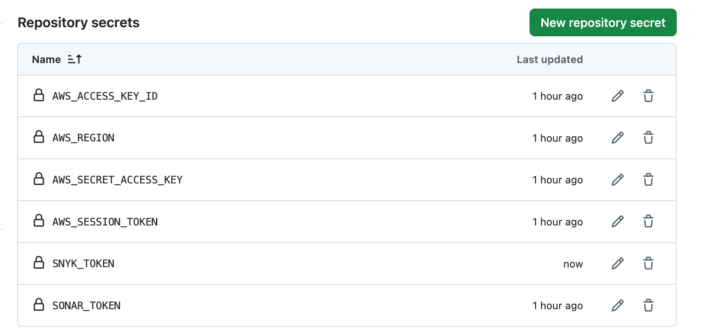

# Backend

## Crear un repositorio en github

Se debe crear un repositorio que solo tenga la aplicacion de frontedn, por ejemplo uno llamado ISY1101-003V-EP02-backend

## Secrets

```
AWS_ACCESS_KEY_ID
AWS_SECRET_ACCESS_KEY
AWS_SESSION_TOKEN
AWS_REGION
SONAR_TOKEN b63dbe366f3e30f246cbb0c2ad235ff469df2dae
SNYK_TOKEN
```



## Repositorio en ECE

Una vez que ya tenemos la infraestructura, creada se procede a la creación del repositorio

```
aws ecr create-repository --repository-name alumnos-backend --region us-east-1
```

## Subir el proyecto

```
git init
git add .
git commit -m "EP02"
git branch -M main
git remote add origin https://github.com/TU-CUENTA-GIT/ISY1101-003V-EP02-backend.git
git push -u origin main
```
